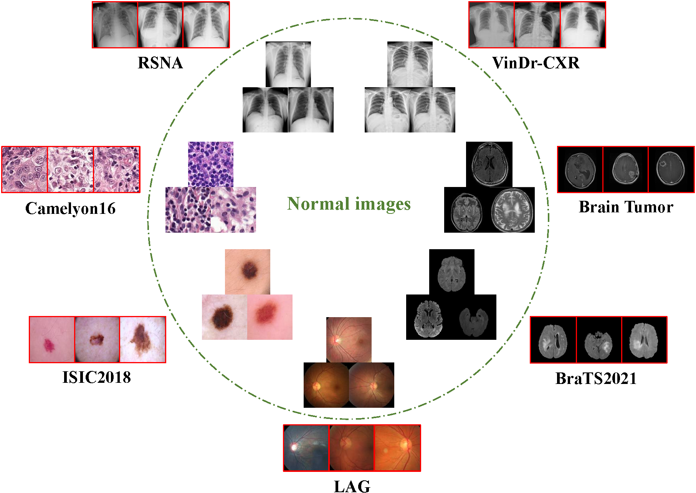
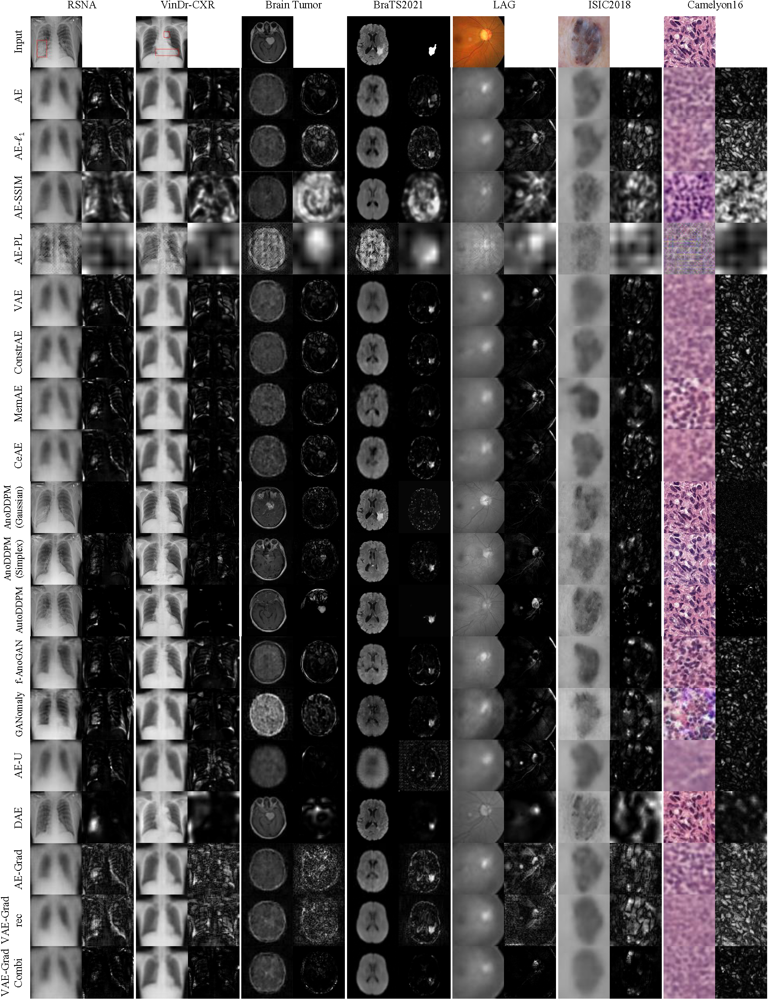
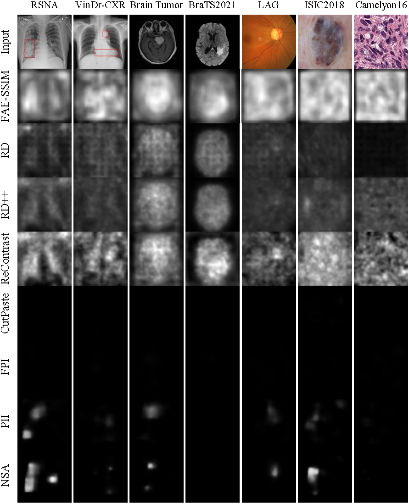

# MedIAnomaly: A comparative study of anomaly detection in medical images

This is the repository for our benchmark paper [MedIAnomaly: A comparative study of anomaly detection in medical images](https://arxiv.org/abs/2404.04518).


<p align="center"></p>


<p align="center"></p>


## Environment

- Python 3.10
- PyTorch 2.1.2


## Data Preparation

We provide the pre-processed seven datasets. 

1. Download the pre-processed datasets from: [MedIAnomaly-Data](https://hkustconnect-my.sharepoint.com/:f:/g/personal/ycaibt_connect_ust_hk/EvxnpUPqTXdKgCGHS1PLy8UBxohYgFfxX_UBzf7Yhcx3Fw?e=cxUUot)
2. Unzip the datasets via:

```shell
tar -zxvf RSNA.tar.gz
tar -zxvf VinCXR.tar.gz
tar -zxvf BrainTumor.tar.gz
tar -zxvf LAG.tar.gz
tar -zxvf ISIC2018_Task3.tar.gz
tar -zxvf Camelyon16.tar.gz
tar -zxvf BraTS2021.tar.gz
```

3. Place the `MedIAnomaly-Data` directory in the user's home directory, i.e., `~/MedIAnomaly-Data/`. (Otherwise, you need to modify the data root in your code.)

**Finally, the data path should have the following structure:**

```
~/MedIAnomaly-Data
├─RSNA
│  ├─images
│  └─data.json
├─VinCXR
│  ├─images
│  └─data.json
├─BrainTumor
│  ├─images
│  └─data.json
├─LAG
│  ├─images
│  └─data.json
├─ISIC2018_Task3
│  ├─ISIC2018_Task3_Training_Input
│  ├─ISIC2018_Task3_Training_GroundTruth
│  ├─ISIC2018_Task3_Test_Input
│  └─ISIC2018_Task3_Test_GroundTruth
├─Camelyon16
│  ├─train
│  │  ├─good
│  ├─test
│  │  ├─good
│  └─ └─Ungood
├─BraTS2021
│  ├─train
│  ├─test
│  │  ├─normal
│  │  ├─tumor
└─ └─ └─annotation
```


## Train & Evaluate

### [Reconstruction-baed methods](./reconstruction)

- [x] AE ($\ell_2$, $\ell_1$, SSIM, Perceptual Loss)

- [x] AE-Spatial

- [x] VAE

- [x] Constrained AE

- [x] MemAE

- [x] CeAE

- [x] GANomaly

- [x] AE-U

- [x] DAE

- [x] AE-Grad

- [x] VAE-Grad ($Grad_{ELBO}$, $Grad_{KL}$, $Grad_{rec}$, $Grad_{Combi}$)


Train and evaluate these methods via:

```bash
cd reconstruction/;
./train_eval.sh
```


### [SSL-based methods](./ssl)

#### one-stage

- [x] CutPaste
- [x] FPI
- [x] PII
- [x] NSA


Train and evaluate these methods via:

```bash
cd ssl/one_stage/;
./train_eval.sh
```


#### two-stage

- [x] CutPaste
- [x] AnatPaste
- [x] ResNet18-ImageNet


Train and evaluate these methods via:

```bash
cd ssl/two_stage/;
./train_eval.sh
```


## Visualization

<p align="center"></p>


<p align="center"></p>


## Acknowledgement

Some datasets and codes in this repository are based on [DDAD-ASR](https://github.com/caiyu6666/DDAD-ASR), [BMAD](https://github.com/DorisBao/BMAD), [NSA](https://github.com/hmsch/natural-synthetic-anomalies), [CutPaste](https://github.com/Runinho/pytorch-cutpaste), [AnatPaste](https://github.com/jun-sato/AnatPaste). We thank the original authors for their excellent work.


## Contact

If any questions, feel free to contact Yu Cai: [yu.cai@connect.ust.hk](mailto:yu.cai@connect.ust.hk).